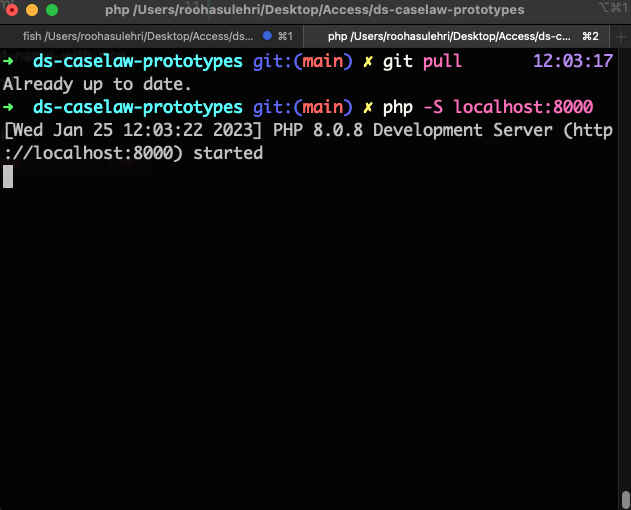

# Find Case Law Prototypes
A space for design ideas and prototyping for the Find Caselaw service

This repo is linked to a Netlify account at https://ds-caselaw-prototype.netlify.app/ for previewing.

### How to run the app 

- Pull the latest branch 
- Make sure you are within the `ds-caselaw-prototype` folder on your local machine before starting the app
- Run the command `php -S localhost:8000`
- Press enter and your app should start running 

See image:

### Advice on creating a new branch

- Always make sure you create a new branch when starting on a new feature or design task, this is to prevent your new code from getting mixed up in the already working directory.
- You can make a new branch for your task by doing the following:
  - Open up your repository in a new terminal window 
  - Pull the `main` branch to make sure you are working on an up-to-date version of the repo
  - Create a new branch by entering the following command 
    - `git checkout -b name-of-new-branch`
  - Press enter and you will be in a new branch, now you can successfully work on a separate branch until you are ready for it to be merged into `main`

### Advice on pushing your branch onto GitHub

Follow these basic steps to get your latest branch up and running onto GitHub:

- `git status`
- `git add .`
- `git commit -m "enter your commit message here"`
- `git push`